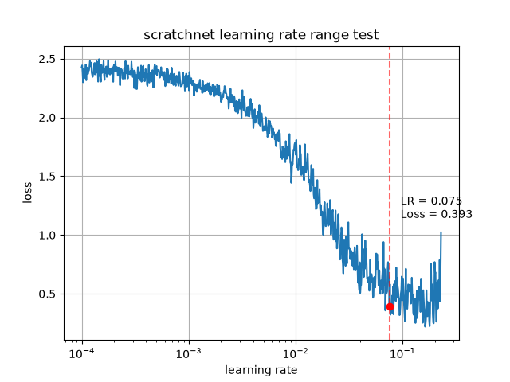
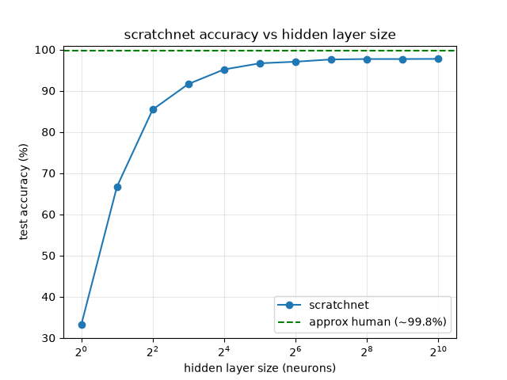
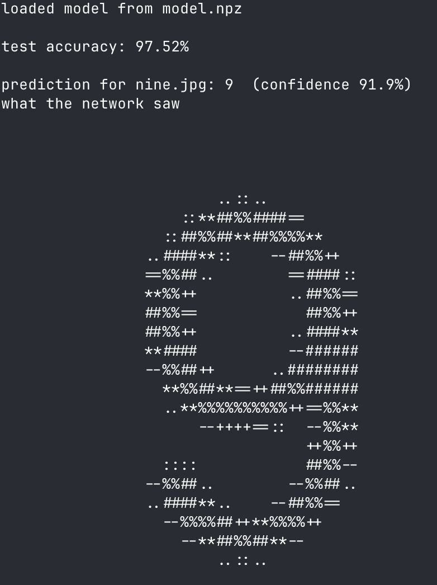

# scratchnet

A neural network built **from scratch in Python and NumPy** that learns to classify MNIST handwritten digits. I wrote every part one by one: the forward pass, the cross-entropy loss, backpropagation (verified with a gradient check), and mini batch gradient descent.

It reaches approx **97–98% test accuracy** on digits it has never seen.

> The full maths: forward pass, the softmax and cross-entropy gradient and every backpropagation equation are worked out by hand in **[`math.pdf`](math.pdf)**. This README covers the code that pdf covers the maths.

## Features

- Pure NumPy implementation of a two-layer neural network (no ML frameworks)
- MNIST loaded and parsed directly from the raw IDX files
- Backpropagation verified with a numerical gradient check
- A single cli entry point for training, evaluation, and experiments
- Save and reload trained models
- Terminal diagnostics, per-digit accuracy, a confusion matrix, and misclassified digits drawn as ASCII
- Two graphs: **loss vs learning rate** and **accuracy vs hidden-layer size**

## Project structure

```
scratchnet/
├── scratchnet.py     # the file to run: CLI, training loop, experiment dispatch
├── network.py        # the network itself and the core maths (forward, backward, etc.)
├── data.py           # downloads and loads MNIST into NumPy arrays
├── report.py         # ASCII digits, plots, and stat tables
├── math.pdf          # hnd worked derivations of the network maths
├── requirements.txt
├── nine.jpg		  # example jpg to try predict with
└── README.md
```

## The architecture

A simple multilayer piece:

```
784 pixels  ->  128 hidden neurons (ReLU)  ->  10 outputs (softmax)
```

- **Input:** each 28×28 image is flattened to 784 values and then normalised to `[0, 1]`
- **Hidden layer:** 128 neurons with a ReLU activation
- **Output layer:** 10 neurons with softmax, giving a probability per digit
- **Loss:** cross entropy
- **Training:** mini batch gradient descent, with He weight initialisation

See [`math.pdf`](math.pdf) for the derivations behind each of these.

## Getting started

Requires Python 3 and the two packages in `requirements.txt` (NumPy and Matplotlib).

```bash
git clone https://github.com/samladbrook/scratchnet.git
cd scratchnet

python -m venv .venv
source .venv/bin/activate

pip install -r requirements.txt
```

MNIST downloads automatically on the first run and is cached in a local `data/` folder.

## Usage

Run everything through `scratchnet.py`. With no flags, it trains and prints the test accuracy:

```bash
python scratchnet.py
```

Add flags to add on extra reports:

```bash
# train then show a detailed breakdown
python scratchnet.py --show-full-stats
python scratchnet.py --show-missed-digits

# diagnostics
python scratchnet.py --show-lr-graph        # loss vs learning rate (quick)
python scratchnet.py --show-hls-graph        # accuracy vs hidden-layer size(slow)

# save a trained model then reload it later without retraining
python scratchnet.py --save model.npz
python scratchnet.py --load model.npz --show-missed-digits --show-full-stats

# custom params
python scratchnet.py --lr 0.15 --epochs 15 --batch-size 128

# full list of options
python scratchnet.py --help
```

### Options

| Flag | Description | Default |
| --- | --- | --- |
| `--epochs N` | Number of passes over the training data | `10` |
| `--batch-size N` | Images per gradient step | `64` |
| `--lr F` | Learning rate | `0.1` |
| `--show-lr-graph` | Graph loss vs learning rate before training | off |
| `--show-hls-graph` | Train across several hidden-layer sizes and graph accuracy vs size | off |
| `--show-full-stats` | Print per-digit accuracy and the confusion matrix | off |
| `--show-missed-digits` | Draw a few misclassified test digits as ASCII art | off |
| `--predict PATH` | Classify a image file of a digit (png/jpg) | — |
| `--save PATH` | Save the trained model to `PATH` (`.npz`) | — |
| `--load PATH` | Load a trained model and skip training | — |
| `--save-graphs` | Save graphs to `images/` instead of opening them now | — |
| `--shush` | Hide the per-epoch training progress | off |

## Results

After 10 epochs with the default settings:

- **Test accuracy:** ~97.6%

The confusion matrix shows the network fails in pretty human like ways. The most common mix ups are between really similar digits like 4 and 9, or 3 and 5.

## Graphs

Two graphs help tune the network. Both save to `images/` when you add the option:

`
python scratchnet.py --show-lr-graph --save-graphs
python scratchnet.py --show-hls-graph --save-graphs
`

### Learning rate range test


The learning rate is taken from tiny to large across one run of small batches, recording the loss at each step. It drops as the rate grows, bottoms out and then explodes once the rate gets to big. The marked ideal lr is the point where the loss drops the fastest and a good value to train with.

### Accuracy vs hidden layer size


A fresh network is trained at each hidden layer size and its test accuracy plotted. Accuracy climbs steeply at first and then flattens off, you can clearly see the diminishing returns of adding neurons. The dashed line marks the approximate human performance for MNIST (~99.8%). CLosing that final gap takes a bit more then a wider hidden layer (see Possible improvements).

## Classifying your own images

Point the model at an image file of a single hadwritten digit:

`python scratchnet.py --load model.npz --predict nine.jpg`

The image is converted to grayscale, resized to 28x28 and then normalised to match MNIST, which usees white digit on a black background. You get the predicted digit, a confidence score and an ASCII preview of exactly what the network saw.

For the best result give it a resonably clean and centred digit with some black space around it.

Below in the example result from running the command above:



## How it learns

Training repeats a simple loop over small batches of images:

1. **Forward pass**: turn 784 pixels into 10 probabilities
2. **Loss**: measure how wrong those probabilities are with cross-entropy
3. **Backpropagation**: work backwards to find each weights gradient
4. **Update**: bump every weight a small step downhill

Because softmax and cross entropy work together, the gradient at the output is essientially `prediction - truth`.

## Possible improvements

Probabley easiest to hardest:

- Swap plain SGD for **momentum** or **Adam** for faster, higher accuracy training
- Add a **learning-rate schedule** (decrease rate over time)
- Add a **second hidden layer** or more neurons
- Add **dropout** to reduce overfitting
- Rebuild as a **convolutional network** (could push ~99%)

## License

This project is licensed under the [MIT License](LICENSE).
